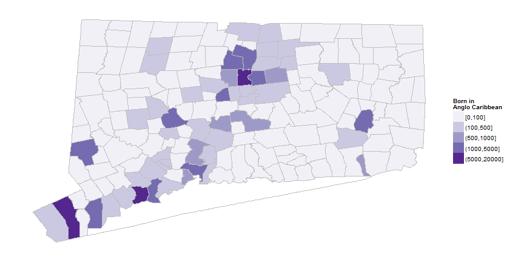

## What is rate of new arrivals?

--- .class #id

Metro Hartford has the highest rate of immigration from the West Indies in the United States ([naturalizations and new permanent residents](http://www.dhs.gov/data-statistics)). About 1 in 6 new arrivals for the region are from the West Indies. (This excludes immigration from Cuba, the Dominican Republic and Haiti.) 

 

--- .class #id

Looking only at arrivals from Jamaica, the Hartford metro region still has the highest percent nationally. 

 

--- .class #id

Within the Caribbean, arrivals from Jamaica are about 80% of all arrivals for 2011-12. Guyana and St. Lucia are the next two countries with the most immigrants to metro Hartford. 

 

--- .class #id

## Where does the West Indian population live now? 

--- .class #id

The population of Caribbean origin are in many towns in the state, although mainly the urban centers. 

--- .class #id

The highest percent from West Indies and Jamaica in the state are in Bloomfield, followed by Hartford and Windsor. East Hartford also has a high rate in our region.

--- .class #id

The Jamaican population are mostly clustered in the smaller set of towns around Hartford. 

--- .class #id
## Are there students that speak Patois at home? 

--- .class #id

Some Connecticut students are recorded as speaking Patois (or 'Patwa') as a second language at home. For the state, Patois was recorded as a home language for about 200 students in 2013-14, or about the same as the occurence of Karen and Khmer(Cambodian). About [30,000 Connecticut residents](http://factfinder2.census.gov/faces/tableservices/jsf/pages/productview.xhtml?pid=ACS_12_1YR_B05006&prodType=table) were born in Jamaica, half living in metro Hartford.

--- .class #id

Of students recorded as speaking a second language at home, a smaller number are recorded as English-language learners. In this case, about 30 students were recorded as Patois-speakers in need of English language assistance in the state. (A few districts have fewer than 5 students and don't report exact results.)

--- .class #id
As a percent of total district enrollment, Patois speakers only comprise a significant share at Jumoke Academy, between 15 - 20% of students come from Patois-speaking households. This is similar to the base population rates in Hartford, Bloomfield and Windsor. No other district in the region reports more than 0.7% students coming from a Patois-speaking household. 

--- .class #id

In addition, for English-language learners, no school district has more than 0.6% students registered as Patois-speakers in need of English language assistance and only three districts (Hartford, Windsor and Bloomfield) register more than 5 students total. 

